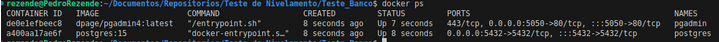
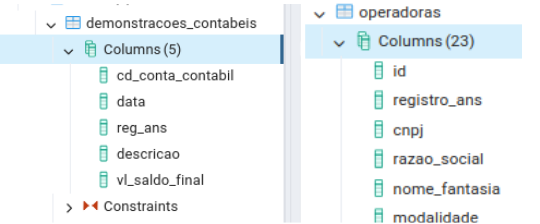
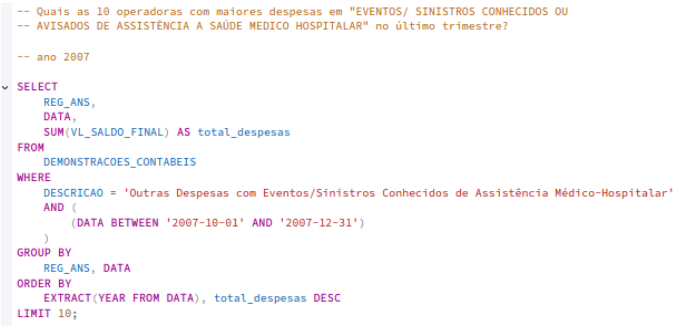

### TESTE DE BANCO DE DADOS

**Tecnologias utilizadas:** 
- **IDE:** VSCode
- **Construção do ambiente:** Docker e Docker Compose
- **Banco de Dados:** pgAdmin 4 e postgres 15 
- **Linguagem:** Shell Script, SQL
 

**Funcionalidades solicitadas:**
- Criação de uma base de dados utilizando Postgres;
- Tabela para armazenar demonstrativos contábeis;
- Importação de arquivos CSV para a base de dados;
- Consultas SQL para obtenção de informações específicas;
- Criação de scripts .sql para execução das tarefas.

**[EXTRA] Funcionalidades adicionais:**
- Configuração do ambiente utilizando Docker;
- Automação do processo de importação de dados utilizando um script Shell;
- Customização opcional:
    - Possibilidade de adicionar novos arquivos CSV para importação automática;
    - Alteração do usuário e senha do banco no docker-compose.yml.
- Utilização do pgAdmin4 para gerenciamento da base de dados;
- Automação do processo de importação de dados utilizando um script Shell.

**Estrutura do Projeto:**

| **Diretório** | **Funcionalidade** |
| --- | --- |
| Teste_Banco/ | Diretório contendo os arquivos do teste |
│-- Arquivos/   |                    Diretório contendo arquivos CSV |
|---- docker-compose.yml   |         Configuração dos containers Docker |
|---- import_csv.sh    |             Script de importação de dados CSV |
|---- init.sql       |               Script de criação da tabela |
|---- pgadmin-server.json  |         Configuração do pgAdmin |
│-- Querys/             |            Diretório com as queries SQL |
|   ---- m.d.Ano.sql        |        Consultas por ano |
|   ---- m.d.UltimoTrimestre.sql   | Consultas por trimestre |

**Fluxo do Programa:**
- Inicialização do ambiente:
    - *docker-compose up -d* para subir os containers do PostgreSQL e PgAdmin.
- Criação da estrutura do banco:
    - O init.sql é executado automaticamente no primeiro start do container.
- Importação dos arquivos CSV:
    - O script import_csv.sh executa a importação dos arquivos CSV para a base de dados.
- Execução das consultas:
    - As queries SQL no diretório Querys/ podem ser executadas diretamente no pgAdmin ou via terminal.

### Executando o projeto:

O projeto foi estruturado com a criação de um container para o PostgreSQL e outro para a interface de administração, utilizando o pgAdmin. Dessa forma, evitamos a dependência do terminal para gerenciar o banco de dados e facilita a visualização dos testes.

**Etapa 1 - Criando o ambiente**

A criação dos containers foi realizada com o Docker Compose, e uma migration foi aplicada para que as tabelas necessárias sejam configuradas automaticamente. Além disso, foi criado um arquivo JSON para configurar o servidor do pgAdmin.

**1.1** Configuração do Postgres:

**1.2** Configuração do pgAdmin:

Os arquivos de configuração incluem a migration para criação das tabelas e um JSON para configurar o servidor do pgAdmin, garantindo um ambiente automatizado e organizado.

**1.3** Migration init.sql para criação das tabelas:

**1.4** pgadmin-servers.json para subir o PgAdmin com a conexão realizada:

Iniciando o projeto, utilizamos o comando docker-compose up -d para subir todos os contêineres necessários.

**1.5** Subindo os containers com docker compose:

**1.6** Verificando se os container estão rodando:

**Etapa 2 - Acessando o banco e inserindo dados**

Acesse a porta 5050 do seu navegador: http://localhost:5050, e faça login:

**2.1** Acessando o PgAdmin:

**2.2** Acessando o Servidor de Banco de Dados:

**2.3** Visualizando as tabelas criadas:

**2.4** Consultando as tabelas vazias:

Executando o script para preencher a tabela: *chmod +x* concede permissão ao arquivo, e *./* o executa. 
O script cria uma tabela temporária para armazenar os dados, importa-os para o banco e, em seguida, a remove.

**2.5** Inserindo os dados na tabela, via script:

Após executar vamos verificar se os dados foram inseridos com sucesso.

**2.6** Dados inseridos na tabela demonstracoes_contabeis:

**2.7** Dados inseridos na tabela operadoras:

**Etapa 3 - Executando as Queries**

As queries de consulta estão localizadas na pasta Querys, onde arquivos como m.d.Ano.sql e m.d.UltimoTrimestre.sql armazena os comandos SQL para realizar as consultas solicitadas. 

**3.1** Quais as 10 operadoras com maiores despesas em "Eventos/Sinistros conhecidos ou avisados de assistência à saúde médico-hospitalar” no último trimestre?

Ano 2007:

Resultado:

Ano 2008:

Resultado:

**3.2** Quais as 10 operadoras com maiores despesas nessa categoria no último ano?

Ano 2008:

