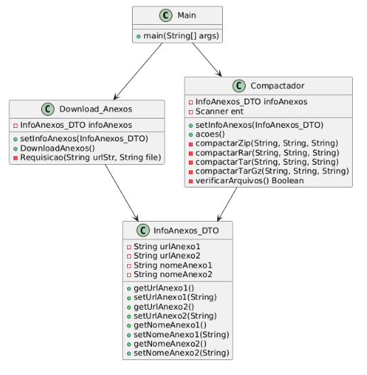
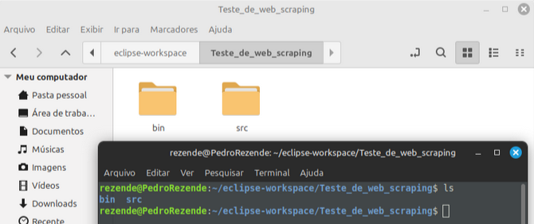
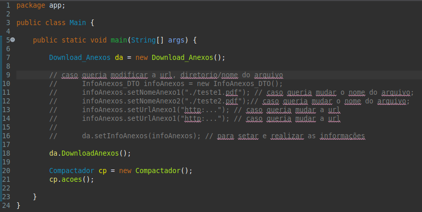
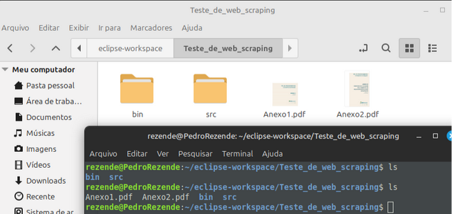
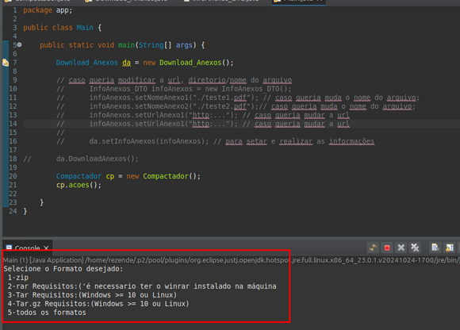
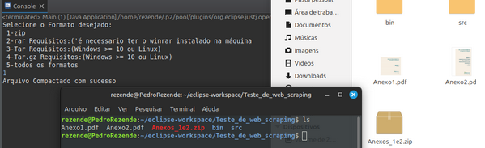
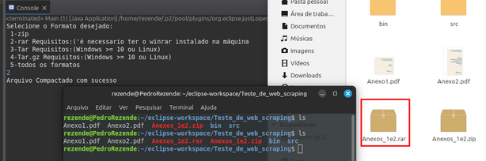
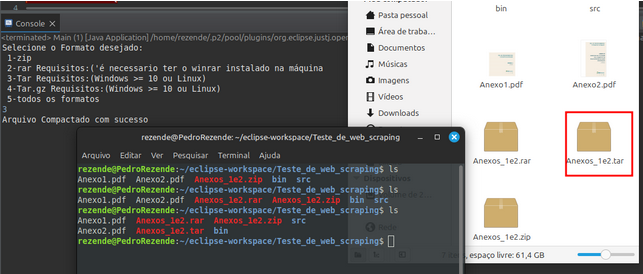
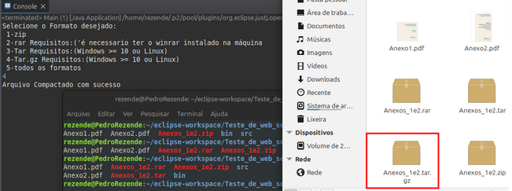
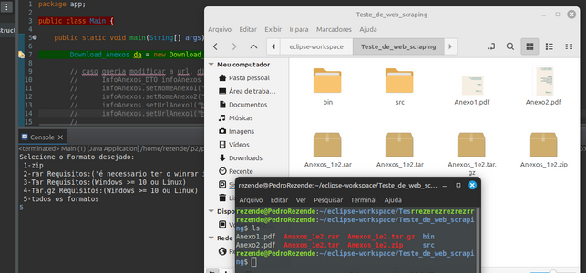

### TESTE DE WEB SCRAPING

**Tecnologias utilizadas:** 

- **Linguagem:** Java
- **IDE:** Eclipse
- **Bibliotecas:** java.io, java.util.zip, java.nio, java.util.Scanner
 

**Funcionalidades solicitadas:**
- Baixar dois PDFs de URLs públicas;
- Salvar localmente com os nomes Anexo1.pdf e Anexo2.pdf.

**[EXTRA] Funcionalidades adicionais:**
- Realiza a compactação dos dois arquivos em diferentes formatos (.zip, .rar, .tar, .tar.gz) ou de todos ao mesmo tempo;
- Antes de compactar, verifica se os arquivos foram baixados corretamente.
- Customização opcional: Permite alterar URL's e nomes dos arquivos antes do download.

**Estrutura do Projeto:**

| **Classe** | **Responsabilidade** | 
| --- | --- |
| Main | Ponto de entrada do programa, inicia o download e a compactação.|
| InfoAnexos_DTO | Armazena as URLs e nomes dos arquivos (padrão ou customizados) |
| Download_Anexos | Gerencia o download dos PDFs usando java.nio. |
| Compactador | Oferece opções de compactação (ZIP, RAR, TAR, TAR.GZ) e verifica arquivos.|

**Fluxo do Programa:**

- O programa baixa automaticamente os dois PDFs.
- Exibe um menu para escolher o formato de compactação.
- Gera o arquivo compactado no diretório do projeto.

**Diagrama de Classes:**

### Executando o projeto:

O projeto baixa dois PDF’s de URL’s públicas. Salva localmente com os nomes Anexo1.pdf e Anexo2.pdf. Realiza a compactação dos dois arquivos em diferentes formatos ( zip, rar, tar e tar.gz).

**Etapa 1 - Baixando os arquivos**

**1.1** Diretório antes do download dos arquivos:

**1.2** Executando apenas o método de download:

**[EXTRA]** Para deixar o teste ainda mais completo, implementei a funcionalidade que permite personalizar o nome do arquivo, e a URL que buscará para fazer o download, sendo assim, o programa pode ser utilizado genericamente, não apenas com a URL solicitada.

**1.3** Executando apenas o método de download:

**Etapa 2 - Compactando os arquivos**

**[EXTRA]** Adicionei um menu que oferece ao usuário a opção de selecionar o formato desejado para o arquivo compactado. Ele aparece após a execução do método.

**2.1** Menu de compactação: 

**2.2** Formato .zip:

**2.3** Formato .rar: 

**2.4** Formato .tar:

**2.5** Formato .tar.gz:

**2.6** Todos os formatos:

Obs.: Os arquivos gerados anteriormente foram apagados.

