### TESTE DE TRANSFORMAÇÃO DE DADOS

**Tecnologias utilizadas:** 

- **Linguagem:** Java
- **IDE:** Eclipse
- **Bibliotecas:** java.io, java.util.zip, java.nio, java.util.Scanner, org.apache.pdfbox (para manipulação de PDF), technology.tabula (para extração de tabelas de PDF)
 

**Funcionalidades solicitadas:**
- Download de PDF: Baixar um arquivo PDF de URL pública da ANS (Agência Nacional de Saúde Suplementar);
- Salvar localmente com o nome especificado (padrão: Anexo1.pdf);
- Extração de tabelas:
    - Extrair tabelas do PDF para formato CSV;
    - Processar e formatar os dados da tabela;
    - Mantém estrutura original com cabeçalhos adequados.
- Modificação de dados:
    - Substituir códigos por legendas descritivas (OD → Seg. Odontológica, etc.); 
- Compactação:
    - Compactar o arquivo CSV resultante em formato ZIP;

**[EXTRA] Funcionalidades adicionais:**
- Customização, permitindo especificar:
    - URL do PDF que será baixado;
    - Nome do arquivo de saída;
    - Colunas a serem modificadas;
    - Nome do arquivo compactado.

**Estrutura do Projeto:**
| **Classe** | **Responsabilidade** | 
| --- | --- |
|Main	| Ponto de entrada, orquestra o fluxo do programa |
|Download_Anexo1 |	Gerencia o download do PDF usando java.nio |
|ExtrairTabela	| Extrai tabelas do PDF usando Tabula/PDFBox e gera CSV |
|ModificadorTabela |	Processa e modifica os dados do CSV conforme seleção do usuário|

**Fluxo do Programa:**
- Baixa o PDF automaticamente da URL especificada.
- Extrai as tabelas para formato CSV.
- Processa o CSV substituindo códigos por legendas (conforme selecionado).
- Compacta o arquivo CSV resultante.
- Gera arquivo ZIP no diretório do projeto.

**Diagrama de Classes:**
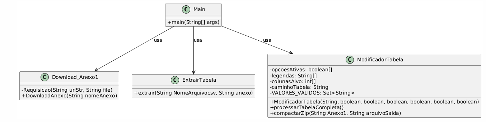

### Executando o projeto:

Após a execução do método de compactação, o programa oferece ao usuário a opção de selecionar o formato desejado para o arquivo compactado, e depois compactar a tabela em .zip 

**Etapa 1 - Download do anexo e criação da tabela**

**1.1** Baixando o anexo 1:

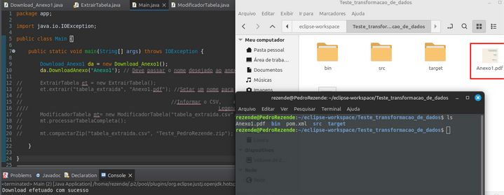

**1.2** Salvando os dados na tabela em formato .csv:

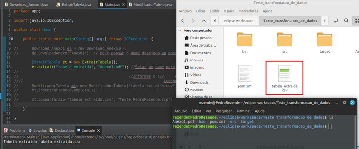

**1.3** Verificando se a tabela está funcional:

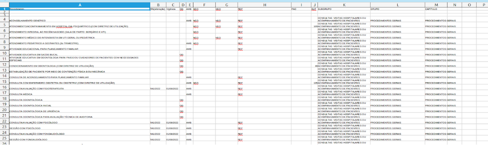

**Etapa 2 - Modificando a tabela**

[EXTRA] É possível selecionar as legendas desejadas no arquivo CSV. Para modificar, basta definir como true ou false.
Legendas disponíveis: OD, AMB, HCO, HSO, REF, PAC.

**2.1** Método ModificadorTabela:

**2.2** Modificando as colunas OD e AMB:

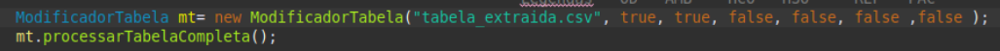

**2.2.1** Tabela modificada:

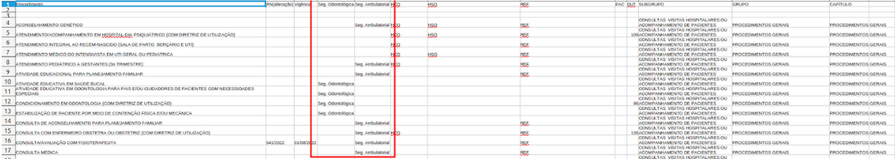

Link da tabela: [OD e AMB.csv](https://drive.google.com/file/d/1V825qkPV6B-iyJcZB97xQK9_vDwkfznD/view?usp=sharing)

**2.3** Modificando as colunas OD, AMB e HCO:

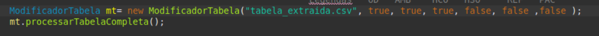

**2.3.1** Tabela modificada:

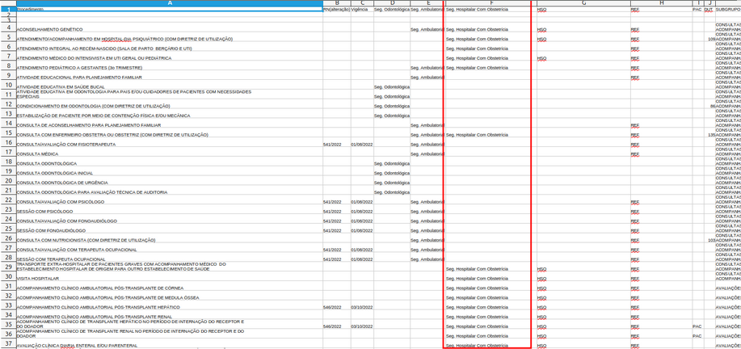

Link da tabela: [OD, AMB e HCO.csv](https://drive.google.com/file/d/1ucd27KLM9UqB82QVJOBB2JU08KU95QDk/view?usp=sharing)

**2.4** Modificando as colunas OD, AMB,HCO e HSO:

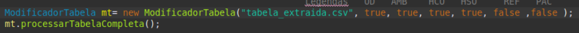

**2.4.1** Tabela modificada:

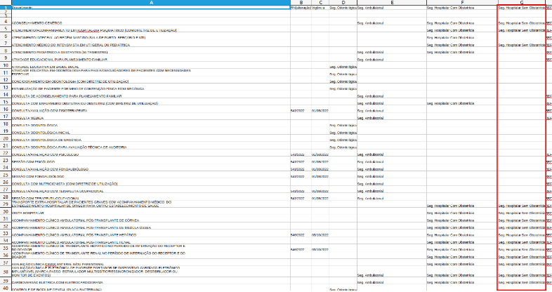

Link da tabela: [OD, AMB, HCO e HSO.csv](https://drive.google.com/file/d/19lqTkq6WlPVZsKquDxdfkuhmQltqAG9l/view?usp=sharing)

**2.5** Modificando as colunas OS, AMB,HCO, HSO, REF, PAC:

**2.5.1** Tabela modificada:

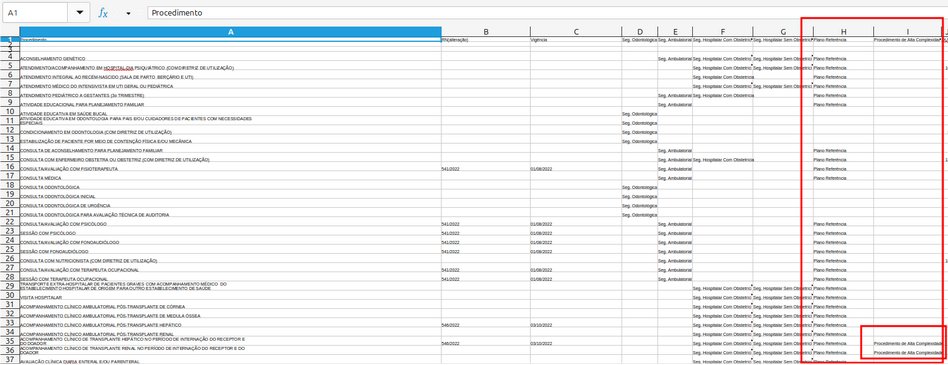

Link da tabela: [OD, AMB, HCO, HSO, REF, PAC.csv](https://drive.google.com/file/d/1HCAZnqJmGfwlFpEgNSjLtzKOz1Y06mhx/view?usp=sharing)

**2.6** Modificando as colunas HCO, HSO, REF, PAC::

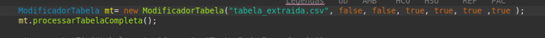

**2.6.1** Tabela modificada:

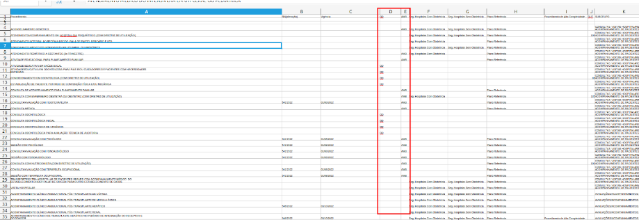

Link da tabela: [HCO, HSO, REF, PAC.csv](https://drive.google.com/file/d/1MUgUEBZkIewckLyXXlJU55qM6ubwMfKg/view?usp=sharing)

**Etapa 3 - Compactando a tabela**

**3.1** Tabela compactada no arquivo Teste_PedroRezende.zip::

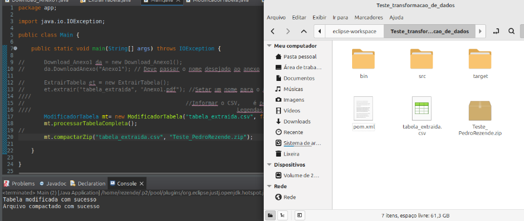

