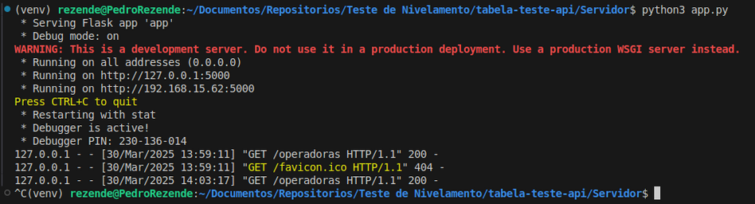
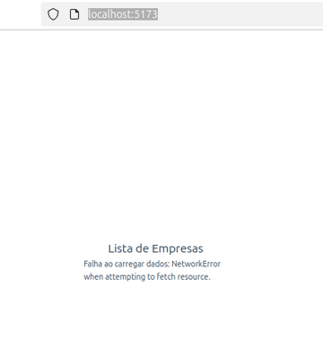

### TESTE DE API

**Tecnologias utilizadas:** 
- **IDE:** VSCode
- **Construção do ambiente:** Docker e Docker Compose
- **Banco de Dados:** pgAdmin 4 e postgres 15 
- **Linguagem:** HTML, CSS e JavaScript
- **Frameworks:** Vue.js e Flask
 

**Funcionalidades solicitadas:**
- Interface web utilizando Vue.js;
- Servidor Python com uma rota que realiza busca textual na lista de cadastros de operadoras;
- Retorno dos registros mais relevantes;
- Elaboração de uma coleção no Postman.

**[EXTRA] Funcionalidades adicionais:**
- Mecanismo de pesquisa na tabela disponibilizada pelo servidor.

**Estrutura do Projeto:**

| **Diretório** | **Funcionalidade** |
| --- | --- |
| tabela-teste-api/ | Diretório contendo os arquivos do teste |
│-- Servidor/   |  Diretório contendo arquivo de configuração do python |
|---- app.py   |         Configuração do servidores |
│-- src/             | Diretório criado pela configuração do ambiente com vue |
-- TesteApi.postman_collection.json  | Collection do postman |

**Fluxo do Programa:**
- Inicialização do Servidor:
    - *python3 app.py* para subir o servidor. 
- Inicialização do vue.js:
    - *npm run dev* para rodar a interface web.
- O servidor vai acessar o banco de dados, e vai fornecer o dados em formato json, para vue, esses dados serão exeposto em formato de tabela.

### Executando o projeto:

Este projeto tem uma interface web desenvolvida com Vue.js, que interage com um servidor em Python. O servidor possui uma rota dedicada para realizar buscas textuais na lista de cadastros de operadoras, retornando os registros mais relevantes.

**Etapa 1 - Banco de dados**

Foi utilizado o mesmo banco e configurações do teste passado.

**1.1** Subindo o banco e verificando se está rodando:

**Etapa 2 - Servidor python**

**2.1** Subindo o servidor:

Acesse *http://localhost:5000/operadoras* no navegador para verificar se o servidor está retornando os dados corretamente da tabela.

**2.2** Servidor respondendo:

**Etapa 3 - Interface web com vue.js**

**3.1** Configurando o vue:

Acesse *http://localhost:5173/* no navegador para verificar se o Vue.js está recebendo os dados corretamente do servidor

**3.2** Acessando a tabela vue:

**Etapa 4  - Mecanismo de pesquisa**

**[EXTRA]** É possível realizar buscas nos campos Registro ANS, CNPJ, Razão Social, Modalidade, CEP, Telefone, Endereço Eletrônico, Representante e Cargo Representante.

**4.1** Barra de pesquisa:

**4.2** Realizando pesquisas:

Exemplo: Pesquisa por Registro ANS e por e-mail.

**Etapa 5  - Outros Testes**

**[EXTRA]** Realizei testes para ver como a aplicação responde em determinadas situações. 

**5.1** Derrubando o servidor python:

**5.1.1** Acessando a tabela:

Para voltar a funcionar é só subir o servidor novamente digitando python3 app.py.

**5.2** Derrubando o banco:

**5.2.1** Derrubando o banco:

**5.2.2** A tabela vai informar que o servidor não está passando os dados:

Para voltar a funcionar é só subir o banco novamente.

**Etapa 6 - Execução da Collection no Postman**

**6.1** Mandando a requisição via postman:

Link da Collection gerada: [TesteApi.postman_collection.json](https://drive.google.com/file/d/1Ri5rz3byRyqS4ZrTFLnBYmXd5F8beXuU/view?usp=sharing)

